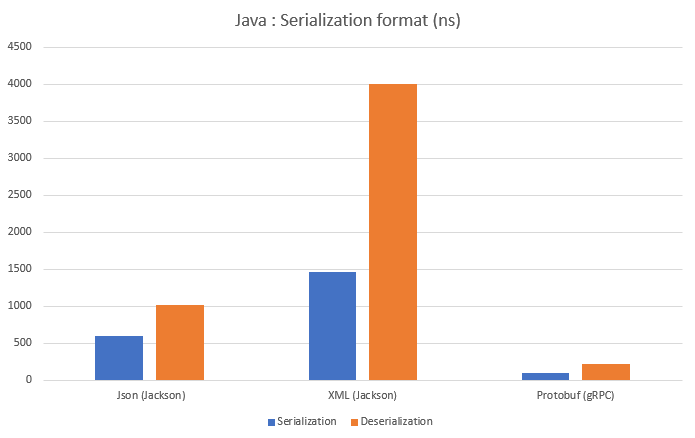

# Service-oriented Architecture Lab

project name : **Blue Galactic X**

## Project Strategy

Project Policies for the team

### Branching

| branch name  | goal                                                                                     |
| ------------ | ---------------------------------------------------------------------------------------- |
| master       | main branch, for the stable version only, must be on develop and tested on develop first |
| develop      | develop branch, each completed task are merged with it                                   |
| feature/BG-X | User Story branch                                                                        |
| hotfix/BG-X  | Hotfix or production critical error from master                                          |
| bugfix/BG-X  | Unexpected Bug that need to be fixe on develop                                           |
| rework/BG-X  | when a rework (or refactor) need to be done                                              |

> BG-X : Blue Galactic with the ID of the issue

### Git

Never push to develop, after finishing a task, make a PR (Pull Request) and wait for at least 2 members of the team to approve.
Each commit must have a link to the ID of the task at the begin of the commit and please, try to make a consistent commit message.

> #X (e.g. #15 with 15 the number of the issue)
>
> GH-X (e.g. GH-15 with 15 the number of the issue)

When working on local, never merge when you want to update your local branch with the latest modification from the remote branch. Use instead *git pull --rebase* to avoid making a mess in the git history when it is not necessary.

### Task

each task must be a US like

#### Title :

**[Pts: x] I am a short description**

the **Pts** correspond to the story points

| Points | Equivalent in days |
| ------ | ------------------ |
| 1      | 3 hours            |
| 2      | 5 hours            |
| 3      | 8 hours            |
| 5      | 10 hours           |
| 8      | 15 hours           |

It is set arbitrary for now and will be adapted throughout the project.

#### Body :

*User Story*

**AS** ...

**I WANT** ...

**SO THAT** ...

*Acceptance Criteria*

**GIVEN** ...

**WHEN** ...

**THEN** ...

(others : *BUT*, *END*)

also (Description, Scope)

>Acceptance Criteria are here to validate the US with User Acceptance Test (e.g. Gherkin testing framework and maybe E2E test or integration test)

## Technology stack and Interface

### Programming Models

#### REST

Call a URI to manage a resource.

#### RPC

Request a method on a other service from an other program over the network.
Synchronous operation, one action at a time. The method is strongly coupled.

[more info](https://searchapparchitecture.techtarget.com/definition/Remote-Procedure-Call-RPC)

#### Document (Messaging-oriented programming)

It is composed of a bus that dispatch an action to a service depending on the message inside the request.
It is asynchrone and the coup­ling between callers and respon­ders is removed.

[more info](https://www.joeforshaw.com/blog/message-oriented-programming)

### Interfaces Differences (Styles)

The comparisons include all possible choices to help us make the right decision.

#### Main Interfaces

Here we compare the REST with the gRPC and the SOAP. gRPC is a specific interfaces so we want to compare it at the top.

| Interface                   | REST                                                      | gRPC                                                                    | SOAP                                          |
| --------------------------- | --------------------------------------------------------- | ----------------------------------------------------------------------- | --------------------------------------------- |
| What is the targeted data ? | Resources                                                 | Action/Message                                                          | Action/Message                                |
| HTTP protocol capability ?  | HTTP/1.1,2                                                | HTTP/2 (proxy if HTTP/1.1 only)                                         | HTTP1.1/2                                     |
| Payload content type ?      | Json                                                      | Binary                                                                  | XML                                           |
| Payload size ?              | Json is relatively compact                                | smaller than Json or XML                                                | Biggest XML message with a lot of information |
| Has a strong typing ?       | Json make difference between number, string, array        | refine typing like int 16/32, string, booleen, enum, struct, date...    | XML strong typing                             |
| Is a Strong contract ?      | no                                                        | yes                                                                     | yes                                           |
| IDL ? Interface Lang. Desc. | swagger for route description (third party)               | proto file                                                              | WSDL                                          |
| Can generate code ?         | with swagger, can generate client                         | proto to lang (server & client)                                         | WSDL to lang (server & client)                |
| What is the main purpose ?  | make API to access resources and compute them on our side | optimize network exchanges, make action (better for Service To Service) | make action on the server                     |
| Ease of implementation ?    | Simple                                                    | framework make it easy                                                  | need a lot of configuration                   |
| Testing tool available ?    | Browser for Get or Postman                                | BloomRPC                                                                | SoapUI                                        |

#### SOAP Interfaces

Here we compare differents SOAP styling (except JSON-RPC but for the comparison between other RPC)

[spec]: https://www.jsonrpc.org/specification

| Interface                   | XML-RPC                                    | JSON-RPC                                   | Doc                                                   | SOAP                           |
| --------------------------- | ------------------------------------------ | ------------------------------------------ | ----------------------------------------------------- | ------------------------------ |
| What is the targeted data ? | Action/Message                             | Action/Message                             | Action/Message                                        | Action/Message                 |
| HTTP protocol capability ?  | HTTP/1.1,2                                 | HTTP/1.1,2                                 | HTTP1.1/2                                             | HTTP1.1/2                      |
| Payload content type ?      | XML                                        | Json                                       | XML                                                   | XML                            |
| Payload size ?              | straightforward but bigger than Json       | Json with [specification][spec] to include | Can validated in an XML validator, WSDL less readable | like Doc but bigger            |
| Has a strong typing ?       | XML RPC accept only simple type            | like any Json object                       | XML strong typing                                     | like Doc                       |
| Is a Strong contract ?      | yes                                        | no                                         | yes                                                   | yes                            |
| IDL ? Interface Lang. Desc. | WSDL                                       | IDK                                        | WSDL                                                  | WSDL                           |
| Can generate code ?         | WSDL to lang (server & client)             | IDK                                        | WSDL to lang (server & client)                        | WSDL to lang (server & client) |
| What is the main purpose ?  | make action on the server                  | make action on the server                  | make action on the server                             | make action on the server      |
| Ease of implementation ?    | need a lot of configuration (WSDL or POJO) | make a json object                         | need a lot of configuration                           | need a lot of configuration    |
| Testing tool available ?    | SoapUI                                     | Postman (make the body of the req)         | SoapUI                                                | SoapUI                         |

If we want to access resources, we have one obvious choice which is REST. To request an Action XML is usually less readable than JSON or Proto so the gRPC looks like a nice choice.
Obviously the problem is that is unreadable because the payload is binary (maybe more secure). The HTTP/1.1 is not usuable without a proxy. it's only a problem if we want to exchange message between a browser without HTTP/2 because we cannot force the HTTP/2 protocol. Except that, the IDL is more readable and it makes easy to share the contract and create client and server object. We are dependent on gRPC framework.

more info :

[Which style of WSDL should I use?](https://www.ibm.com/developerworks/webservices/library/ws-whichwsdl/)

[gRPC tuto](https://grpc.io/docs/languages/node/quickstart/)

[gRPC framework](https://blog.ineat-group.com/2020/07/grpc-new-challenger-approaching/)

> Binary > Json > XML

> for RPC and Document, we compare only literal style not the encoded one.

### technology stack

[KafkaJS]: https://kafka.js.org/
[Spring-Kafka]: https://www.baeldung.com/spring-kafka

| Techno                                    | Nodejs                                  | Spring boot                                           | JavaEE                                                             |
| ----------------------------------------- | --------------------------------------- | ----------------------------------------------------- | ------------------------------------------------------------------ |
| Multiple EndPoints ?                      | yes                                     | yes                                                   | yes                                                                |
| Can it use REST ?                         | piece of cake                           | little config but easy                                | A simple webservice is easy to deploy                              |
| Can it use Document SOAP ?                | yes but only contract first             | yes, spring-ws contract first and jax-wx both         | yes, jax-ws                                                        |
| Can it use gRPC ?                         | yes with gRPC npm                       | yes with gRPC dependency and easy to use              | more complicated the spring but okay                               |
| Testing tool for unit test ?              | Chai, etc.                              | JUnit                                                 | JUnit                                                              |
| Testing tool for integration test ?       | Supertest Jest (gherkin for functional) | Spring testing framework (gherkin for functional)     | arquillian (gherkin for functional)                                |
| Database Impl easy ?                      | simple but more configuration with ORM  | simple with autoconfiguration with ORM                | need to configure the database, the persistance and make the Query |
| Can it use Kafka ?                        | yes [KafkaJS]                           | yes [Spring-Kafka]                                    | yes, but well ...                                                  |
| Kafka repo Activity ?                     | 10 days ago                             | 3 days ago                                            | some hours                                                         |
| SOAP lib/fram well maintain and updated ? | a month ago                             | 4 days ago                                            | +2 years ago                                                       |
| REST lib/fram well maintain and updated ? | 6 months ago                            | 5 days ago                                            | some days ago                                                      |
| gRPC lib/fram well maintain and updated ? | 3 months ago                            | 2 days ago                                            | 10 days ago                                                        |
| Well adapted for integration tools ?      | no problem and fast to run              | no problem and a relatively fast to run               | no problem but 10 times slower than spring to run                  |
| Is it well structured ?                   | no contraints, it's up to us            | Framework so architure well made and easy to maintain | like a Java project :)                                             |

more info :

[RPC and Document Style](https://www.javapedia.net/Web-services/1000)

[Spring gRPC](https://www.baeldung.com/grpc-introduction)

[Spring Jax-WS](https://www.baeldung.com/jax-ws)

[Spring-boot SOAP WS](https://www.baeldung.com/spring-boot-soap-web-service)

**last update** : 19/09/2020

Nodejs or Spring-boot look both like a good choices. Nodejs might offer a faster start than Spring-boot but it is more easy to add database and testing to it. With Spring-boot we can maintain our code more easely because we are scoped by the framework.

> NB : cannot use gRPC on the same port as REST or SOAP. We need an other endpoint because of the limitation of the library

### Serializer and Deserializer Format

#### XML vs Json vs Protobuf

| Format            | XML                                                                      | Json                                                           | Protobuf                                 |
| ----------------- | ------------------------------------------------------------------------ | -------------------------------------------------------------- | ---------------------------------------- |
| Briefness         | Really verbose                                                           | concise syntax with key:value                                  | binary format, the most concise of all   |
| Human Readability | Readable but a lot of tags                                               | easy to read                                                   | not human-readable                       |
| language support  | Highly supported with build library                                      | Highly supported with build library                            | support most language with library       |
| Data type support | flexible but need more information in the tag (see XML-RPC and Document) | support map, number, string, bool without any need of metadata | can define data structure like an entity |
| Performance       | fast but typically slower than Json                                      | fastest human-readable format                                  | very very fast format                    |

> regarding the result in Java, the best approach would be the Protocol Buffer to serialize and deserialize

##### notes
XML is readable but harder to write with contract-first approach
JSON is easy to write but cannot make a strong contract and a way to generate code
Protobuf is not readable but the proto file are the most easy and human friendly among all and make it possible to define a strong contract
